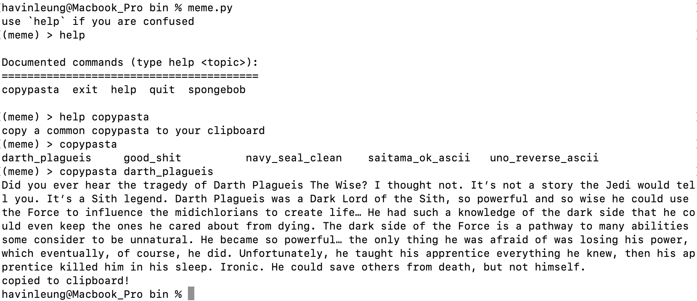

**\[Warning - may have some inappropriate language due to the nature of some copypastas \]**

CLI for some memey stuff (currently MacOS only).

Deps:

  - Python3
  - pbcopy (I believe this is a MacOS builtin)

Setup (optional):
   - stick it into a directory in your PATH env variable and `chmod +x` it

Usage:
  - either run it with `python3 meme.py` simply `meme.py` if you did the optional setup

Examples:

